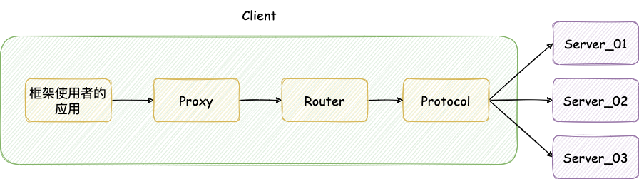

# RPC框架整体设计

## 整体结构分析

RPC (remote procedure call) ，远程过程调用。我们将 TRPC 框架的架构分为了以下几个核心组件：

- Server - 被调用者程序
- Client - 调用者程序
- Client Stub - 将客户端请求的参数、服务名、服务地址进行序列化打包并发送给服务端
- Server Stub - 接受到客户端的数据后进行解包，并调用本地方法


## 调用流程分析

## 代理层设计

站在框架使用者的角度，使用者希望在使用框架的时候，可以屏蔽其内部的细节，使得使用起来就像本地方法调用一样方便好用。

以下面的代码为例：

```java
public class App {
  	public static void main(String[] args) {
      	RpcServer server = new RpcServer("127.0.0.1", 9088);
      	server.connnect();
      	// 调用远程的 sendSms() 方法，并给出方法参数
      	Object response = server.doRef("sendSms", "这是一条短信信息", 12345678901);
      	System.out.println(response);
    }
}
```

上述代码在本地的应用程序中调用远程的 `sendSmsk()` 方法来发送短信，短短的几行代码，内部屏蔽了许多细节。`server.doRef()` 内部就是一种代理的手段，内部可以设计一个统一的代理组件，辅助开发者发送远程服务的调用，并将数据结果返回。

所以面对发送端的请求，可以设计一个代理层，统一将内部的细节都屏蔽起来，让调用者使用起来无感知。


## 路由层

当面对的服务提供者是一组集群的时候，需要考虑如何确定最终请求的服务提供者。这里采用引入一个叫做「路由」的角色，通过路由层内部的规则去匹配对应的服务提供者。

路由层需要考虑以下几个点：

- 如何获取到服务提供者的地址和端口；
- 如何从集群服务中做筛选 (负载均衡) ；
- 如何较好兼容后期的路由扩展；
- 某个服务下线之后如何处理。


## 协议层

`Client` 端在使用 RPC 框架进行远程调用的时候，需要对数据信息进行统一的包装和组织，即采用统一的序列化协议进行序列化操作。`Server` 端接收到数据后也要进行反序列化。对于序列化、反序列化的操作可以统一封装到协议层实现。

在路由层确定好目标服务之后，就会将对应的地址信息、请求数据传输到协议层进行封装。



## 可插拔式组件设计与开发

从本地请求到协议层发送数据，整个链路中可能还需要考虑后续的一些二次扩展设计，例如某些自定义的条件的过滤，服务分组等。因此在代理层和路由层之间加上一些链路模块，提高扩展性。


## 注册中心层

当存在多个服务提供者的时候，如何获取到各个服务提供者的信息？就要用到注册中心。各个服务提供者都在注册中心中进行注册，具体来说即将自己的服务名和地址、端口等详细信息都上报到注册中心，并且在服务上线、下线时都会通知到注册中心。

进行远程调用的时候就从注册中心中获取到服务提供者的信息。

常用的注册中心有 `ZooKeeper` 、`Nacos` 等。

注册中心层需要考虑的问题有：

- 如何与注册中心进行基本的连接访问；
- 如何监听服务数据在注册中心的实时变化；
- 注册中心如果出现了异常，需要有哪些安全手段。


## 容错层

在远程调用的过程中，不可避免地会出现一些异常情况。因此 RPC 框架在处理调用异常时通常都会提供一些容错方面的处理手段，常见手段有：超时重试、快速失败、无限重试、出现异常后回调指定方法、无视失败等。

将这些处理手段统一抽象出来，交给容错层去处理。


## 服务提供者的线程池

当请求发送到了服务提供者，服务提供者需要对其进行相应的解码，然后再进行后续处理。这部分工作交给专门的线程去计算。也抽象出一层来进行封装。

核心问题有：

- `IO` 线程和工作线程的拆分；
- 调用结果和客户端请求的唯一匹配；
- 客户端请求后的同步转异步处理；
- 单一请求队列和多请求队列的设计差异性。


## 接入层

在完成整套 RPC 框架后，需要考虑如何将其接入到实际开发项目中。大多数团队使用的技术都是基于 Spring 、SpringBoot 框架作为基本骨架，所以此框架也接入并提供 SpringBoot Starter ，使得 SpringBoot 项目能很好地接入。

这部分封装成接入层。


