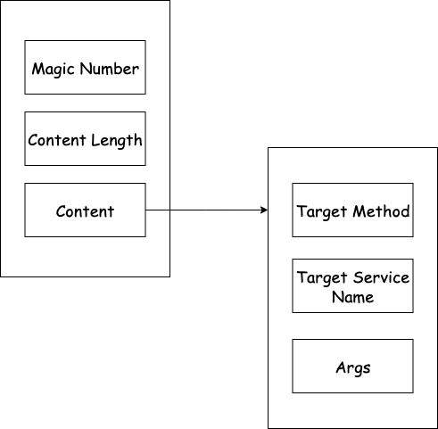

# 序列化技术

服务调用方需要将存储了信息(如方法名、方法参数)的对象序列化以后再通过网络传输到服务提供方，服务提供方反序列化得到对应的数据，再调用目标方法。

在本框架中，定义的数据协议的格式如下：

```java
public class RpcProtocol {
    //魔数, 作用类似 java class 字节码的 cafe babe , 用于验证
    private final short magicNumber = MAGIC_NUMBER;
    //内容长度, 用于解决 TCP 的粘包、半包问题
    private int contentLength;
    //具体内容数据
    private byte[] content;
}
```

其中，具体内容数据的结构又是这样的：

```java
public class RpcInvocation {
    //请求的目标方法
    private String targetMethod;
    //请求的目标服务名称
    private String targetServiceName;
    //请求参数信息
    private Object[] args;
    // 唯一标识
    private String uuid;
}
```

用图表示自定义协议数据格式即：



所以，在序列化时需要将 `RpcInvocation` 转换成 `byte[]` ，在目前的实现中，这个过程是先将 `RpcInvocation` 序列化成 `Json` 字符串，再通过字符串的 `getBytes()` 方法获取到 `byte[]` 。

至于将 `RpcProtocol` 转换成 `byte[]` 的过程，则由 `Netty` 框架完成，因为 `content` 已经是 `byte[]` 了，而 `magicNumber` 和 `contentLength` 占用字节不多。

所以，序列化层的关键还是如何将 `RpcInvocation` 转换成 `byte[]` 。

目前采用的先序列化成 `Json` 字符串，再获取到字节数组的方式当然可以实现功能，但是我们思考一下序列化需要关注的核心是什么：
- 兼容性 - 不局限于某一门语言，一方采用 Java 语言编写的序列化，另一方是采用 Golang 或 Python 编写的应用也可以反序列化；
- 字节码流的大小 - 序列化得到的字节码流需要在网络中传输，因此最终得到的码流的大小自然越小越好。

目前市面上的序列化技术有很多，例如有 JDK 自带的序列化技术、Hessian、Kryo、Protobuf、FastJson 等。

因此，TRPC 框架要支持主流的序列化技术，且支持自定义序列化和反序列化的方式，因此专门抽象出序列化层负责完成序列化和反序列化。

具体实现，即在 `org.trpc.framework.serialize` 包下定义 `SerializeFactory` 接口，实现该接口即实现序列化和反序列化。框架提供几种序列化技术，使用者也可以自行实现自定义的序列化技术。

框架实现的序列化技术有：
- JDK 自带的序列化技术 (缺点：只支持 Java 语言，兼容性差；生成的字节码也并不精简) ；
- FastJson (即前面一直采用的序列化方式) ；
- 待扩展...