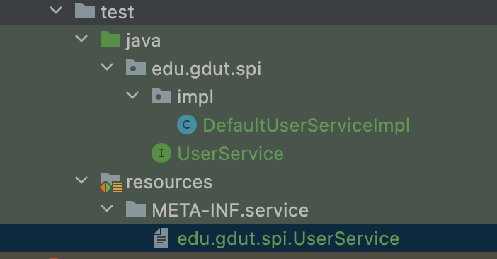

# 可插拔式扩展组件

## SPI 和 API

SPI 的全称叫做：Service Provider Interface，
它是一种通过外界配置来加载具体代码内容的技术手段。
在如今常见的中间件产品当中，
大多数的中间件产品都会参照微内核架构进行设计，
其大致意思是指，将框架的核心部分独立出来，
框架的API面向与业务开发人员，
而核心的框架内部扩展功能可以交给一些经验丰富，能力更高的技术人员负责。

通俗地讲：
- API 给框架的使用人员使用；
- SPI 给框架的扩展人员使用。

## JDK 提供的 SPI 机制

直接用案例说话：

这是定义的一个接口：

```java
package edu.gdut.spi;

public interface UserService {
    void save();
}
```

这是对接口的具体实现：

```java
package edu.gdut.spi.impl;

import edu.gdut.spi.UserService;

public class DefaultUserServiceImpl implements UserService {
    @Override
    public void save() {
        System.out.println("save userInfo");
    }
}
```

在工程的 `resources` 目录下新建 `META-INF/services` 文件夹, 
并且新建一份叫做 `edu.gdut.spi.UserService` 的文件：



在文件里面写上 `edu.gdut.spi.impl.DefaultUserServiceImpl` 。

测试类：

```java
package edu.gdut;

import edu.gdut.spi.UserService;
import org.junit.Test;

import java.util.Iterator;
import java.util.ServiceLoader;

public class SpiTest {

    @Test
    public void testSpi() {
        ServiceLoader<UserService> services = ServiceLoader.load(UserService.class);
        Iterator<UserService> iterator = services.iterator();
        while (iterator.hasNext()) {
            UserService us = iterator.next();
            us.save();
        }
    }

}
```

执行结果：

```
save userInfo
```

## Java SPI 机制的运用

当年 JDK 内置了 SPI 机制之后，一些数据库驱动包便开始广泛采用了此类技术。例如 MySQL 的连接驱动包中便采用了这类设计。


## Java SPI 机制的缺陷

虽然看起来这套SPI机制使用会比较方便，但是依然是存在一些问题：

在 `META-INF/services` 下的配置中如果存在 N 个实现类，采用 JDK 自带的 SPI 机制会一次性将它们进行初始化加载。在加载的过程中如果涉及到了一些比较耗时的操作，会非常浪费资源。

如果扩展点加载失败，会导致调用方报错，而且这个错误很难定位到是这个原因。

所以为了优化这些存在的问题，后期许多中间件技术都使用了自研的 SPI 机制，例如 Dubbo 、SpringBoot 。它们在使用 SPI 加载的时候都可以实现按照约定配置加载，例如 Dubbo 内部会采用 key-value 的格式去对类执行实例化操作。

在本框架中，也会通过自研 SPI 机制来实现扩展功能。

## 框架引入 SPI 机制

以注册中心为例，原来的代码：

```java
public void doSubscribeService(Class serviceBean) {
    if (abstractRegister == null) {
        abstractRegister = new ZookeeperRegister(clientConfig.getRegisterAddr());
    }
    URL url = new URL();
    url.setApplicationName(clientConfig.getApplicationName());
    url.setServiceName(serviceBean.getName());
    url.addParam("host", CommonUtils.getIpAddress());
    Map<String, String> result = abstractRegister.getServiceWeightMap(serviceBean.getName());
    URL_MAP.put(serviceBean.getName(), result);
    abstractRegister.subscribe(url);
}
```

如果扩展支持多个注册中心的话，就要改代码：

```java
if (registryType.equals("zookeeper")) {
    abstractRegister = new ZookeeperRegister();    
} else if (registryType.equals("nacos")) {
    abstractRegister = new NacosRegister();
}
```

引入 SPI 后，即可不必通过 `if-else` 来在代码中控制使用哪个注册中心，而是通过 SPI 来加载：

```java
public void doSubscribeService(Class serviceBean) {
    if (ABSTRACT_REGISTER == null) {
        try {
            //使用自定义的SPI机制去加载配置
            EXTENSION_LOADER.loadExtension(RegistryService.class);
            Map<String, Class> registerMap = EXTENSION_LOADER_CLASS_CACHE.get(RegistryService.class.getName());
            Class registerClass =  registerMap.get(clientConfig.getRegisterType());
            //真正实例化对象的位置
            ABSTRACT_REGISTER = (AbstractRegister) registerClass.newInstance();
        } catch (Exception e) {
            throw new RuntimeException("registryServiceType unKnow,error is ", e);
        }
    }
    URL url = new URL();
    url.setApplicationName(clientConfig.getApplicationName());
    url.setServiceName(serviceBean.getName());
    url.addParameter("host", CommonUtils.getIpAddress());
    Map<String, String> result = ABSTRACT_REGISTER.getServiceWeightMap(serviceBean.getName());
    URL_MAP.put(serviceBean.getName(), result);
    ABSTRACT_REGISTER.subscribe(url);
}
```

代理类型也是同理：

之前：
```java
RpcReference rpcReference;
if (JAVASSIST_PROXY_TYPE.equals(clientConfig.getProxyType())) {
    //rpcReference = new RpcReference(new JavassistProxyFactory());
    throw new RuntimeException("Javaassist 动态代理未实现, 请使用 JDK 动态代理!");
} else if (JDK_PROXY_TYPE.equals(clientConfig.getProxyType())) {
    rpcReference = new RpcReference(new JDKProxyFactory());
} else {
    throw new RuntimeException("不支持的动态代理类型: " + clientConfig.getProxyType());
}
```

引入 SPI 后：
```java
RpcReference rpcReference;
//使用自定义SPI机制去加载动态代理的配置
try {
    EXTENSION_LOADER.loadExtension(ProxyFactory.class);
    LinkedHashMap<String, Class> proxyMap = EXTENSION_LOADER_CLASS_CACHE.get(ProxyFactory.class.getName());
    Class proxyClass = proxyMap.get(clientConfig.getProxyType());
    rpcReference = new RpcReference((ProxyFactory)proxyClass.newInstance());
} catch (Exception e) {
    throw new RuntimeException("proxyType unknown, error is ", e);
}
```

序列化技术、路由层负载均衡技术和过滤器链都可以采用 SPI 进行加载。不再是 `if-else` , 而是更好的 SPI 。

框架扩展人员扩展了新的注册中心/代理/序列化技术/路由层/过滤器链的话，只需要在 `META-INF/trpc` 下对应的接口文件中配置上自己的扩展即可生效，而不用修改框架的源代码。

这也就是给框架扩展人员使用的 SPI 的好处。