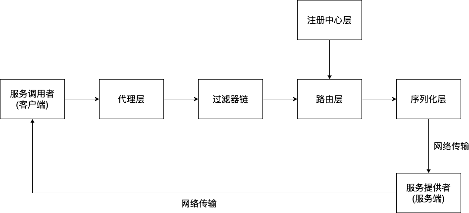

# 并发编程

先看一下到目前为止，框架的模型是怎么样的：



## 服务端的并发优化

我们来看一下从客户端到服务端，经过网络传输，请求到达服务端后的处理过程，它是由 `Netty` 框架负责的：

```java
// 服务端收到请求后执行的请求处理函数
public void channelRead(ChannelHandlerContext ctx, Object msg) throws Exception {
    RpcProtocol rpcProtocol = (RpcProtocol) msg;
    RpcInvocation rpcInvocation = SERVER_SERIALIZE_FACTORY.deserialize(rpcProtocol.getContent(), RpcInvocation.class);

    // 执行过滤链路
    SERVER_FILTER_CHAIN.doServerFilter(rpcInvocation);

    Object aimObject = PROVIDER_CLASS_MAP.get(rpcInvocation.getTargetServiceName());
    Method[] methods = aimObject.getClass().getDeclaredMethods();
    Object result = null;
    for (Method method : methods) {
        if (method.getName().equals(rpcInvocation.getTargetMethod())) {
            if (method.getReturnType().equals(Void.TYPE)) {
                method.invoke(aimObject, rpcInvocation.getArgs());
            } else {
                result = method.invoke(aimObject, rpcInvocation.getArgs());
            }
            break;
        }
    }
    rpcInvocation.setResponse(result);
    RpcProtocol respRpcProtocol = new RpcProtocol(JSON.toJSONString(rpcInvocation).getBytes());
    ctx.writeAndFlush(respRpcProtocol);
}
```

把这个函数精简一下：

```java
// 服务端收到请求后执行的请求处理函数
public void channelRead(ChannelHandlerContext ctx, Object msg) throws Exception {
    // 反序列化拿到请求中携带的数据

    // 执行过滤链路

    // 解析出要调用的目标方法的名字和参数
    
    // 调用目标方法
        
    // 将方法返回结果序列化
    
    // 将序列化后的方法返回结果响应回客户端
}
```

可以发现：**整个过程都是「同步」执行的，因此，问题在于：IO 线程和业务线程是同一个**。

在互联网公司中，通常集群环境中会涉及到数以千万的rpc远程调用，
为了提高系统的整体吞吐性能，我们通常会部署足够多的机器来支撑整个服务的访问承载能力。
假设说一台机器的RPC接口请求负载上限为50次请求每秒，那么若想实现支撑2000次请求每秒的并发访问，
则需要：`2000 / 50 = 40` 个服务节点。

从经济成本来看，对于初创公司团队来说可能会是一笔不小的开销。
但是倘若我们在代码设计上能够尽量保证一个节点的负载上限为1000次请求每秒的话，
则只需要：`2000 / 1000 = 2` 个服务节点即可，从而大大降低系统的承载能力。

那么，在目前 IO 线程和业务线程是同一个的情况下，负责接受请求的 IO 线程在接受了一个请求以后就必须等待该请求的业务执行完毕以后，
它才能继续去接受其他请求。这自然就会造成 1s 内能接受的请求数量减少。

所以，一个自然的想法就是让 IO 线程和业务线程分离，IO 线程在接受到一个请求以后，把它交给业务线程以后立即去接受其他请求，
由业务线程负责慢慢处理请求，这样 1s 内能接受的请求数量就会变多。

显然，这个过程就是通过多线程将原来的「同步」执行变成「异步」执行。

进一步考虑，如果 IO 线程接受到一个请求马上就开一个线程来处理该请求，自己就回去继续接受其他请求的话，那么如果同时来了很多请求的话，
就会开启过多线程，很有可能耗尽系统资源。因此，此时就可以通过「线程池」来解决这个问题。

继续考虑，倘若当请求直接抵达服务器的时候我们就将数据丢入到业务线程池中，未免也有些过于鲁莽，
因为线程池的消费能力和池中的线程数有关。
而线程数的配置通常又取决于CPU的核心数目。
倘若要支撑1000次请求同时访问，这种设计很容易就会将线程池撑爆。为了尽量减少对线程池的压力，
通常会单独使用一条堵塞队列用于接收请求，然后在队尾由业务线程池来负责消费请求数据。
这样即使请求出现了堆积，也是堆积在一条我们比较能轻易操作的队列当中。

## 客户端的异步调用

服务端关注的是能同时处理更多的请求。而客户端关注的是发起调用后得到响应的时间越短越好。

换句话说，客户端不希望「等」太久，它希望发起调用后，越快能接着做它的事情越好，特别是客户端接下来要做的事情与调用结果无关的时候，
客户端更是希望不等调用结果返回，它立刻就去做其他事情了。

因此，对于客户端，框架提供 `setAsync(boolean isAsync)` 来指定是同步调用还是异步调用。